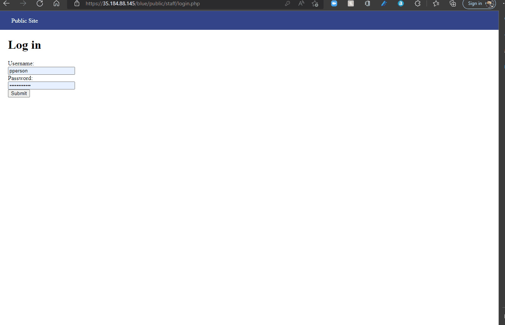
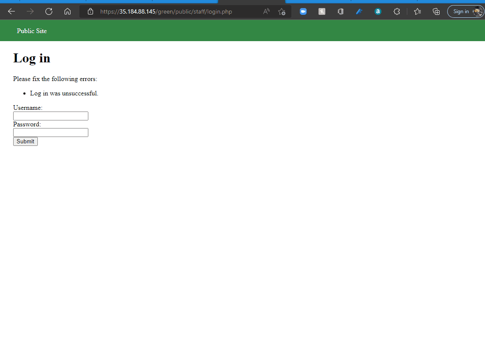
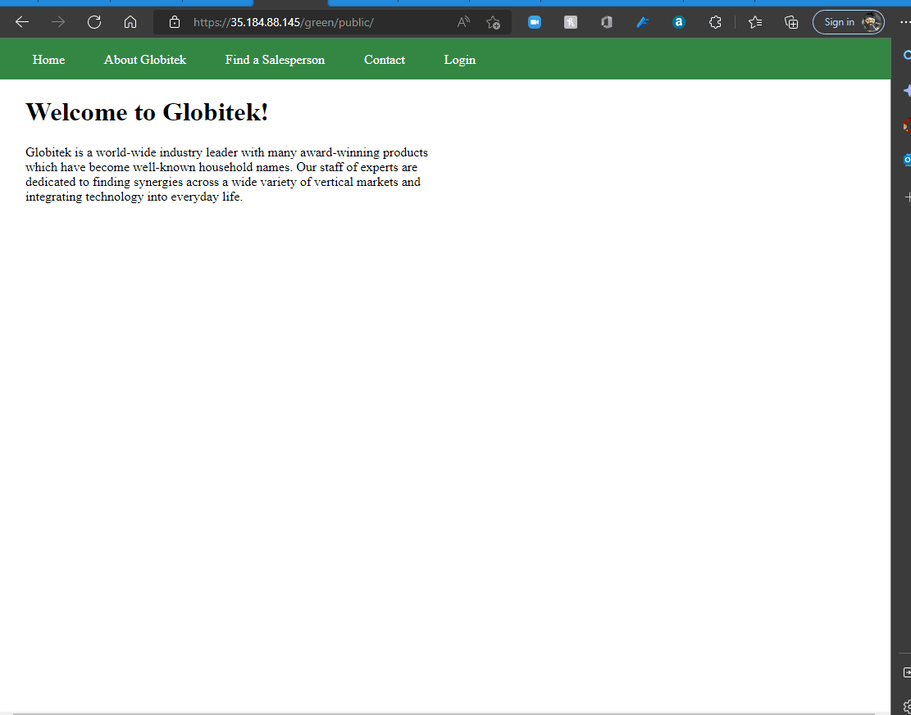
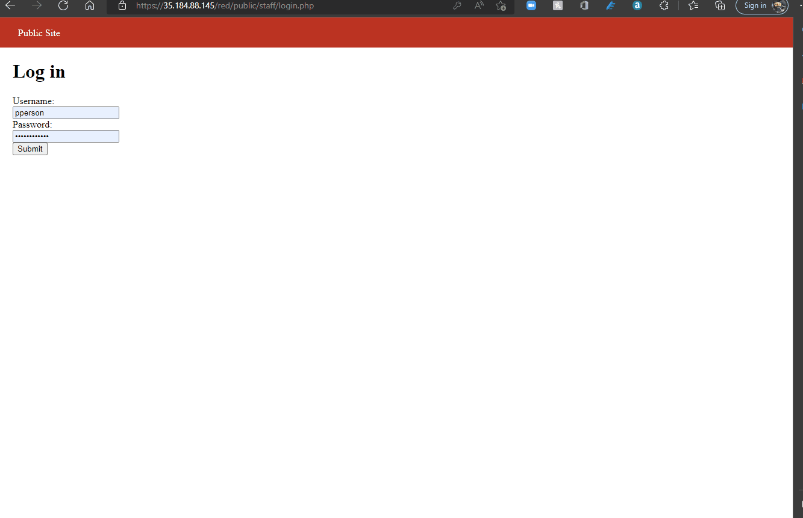

# Pen Testing Live Targets

Time spent: **X** hours spent in total

> Objective: Identify vulnerabilities in three different versions of the Globitek website: blue, green, and red.

The six possible exploits are:

* Username Enumeration
* Insecure Direct Object Reference (IDOR)
* SQL Injection (SQLi)
* Cross-Site Scripting (XSS)
* Cross-Site Request Forgery (CSRF)
* Session Hijacking/Fixation

Each color is vulnerable to only 2 of the 6 possible exploits. First discover which color has the specific vulnerability, then write a short description of how to exploit it, and finally demonstrate it using screenshots compiled into a GIF.

## Blue

Vulnerability #1: Insecure Direct Object Reference

Description: The back end of the website has not been properly sanitized, making it vulnerable to Insecure Direct Object Reference. The developer did not make sure if object reference request is made public or not. This vulnerability made it possible to access profiles that are not supposed to be public.

## Green 1

Vulnerability #1:  Username Enumeration

Description: I tried to login with the username: jmonroe99 which is an existing user and it failed and an error in bold saying "Log in was unsuccessful" was displayed. When I try a none existing, the same error was displayed, but not bolded. Therefore, the careless developer mistake allow anyone to be able to identify an existing user.

Vulnerability #2:   Cross-Site Scripting

Description: I paste this script  in the comment section and submit. in the feedback section of the website detected that a script was submitted.

## Red

Vulnerability #1: Insecure Direct Object Reference

Description: The back end of the website has not been properly sanitized, making it vulnerable to Insecure Direct Object Reference. The developer did not make sure if object reference request is made public or not. This vulnerability made it possible to access profiles that are not supposed to be public.

